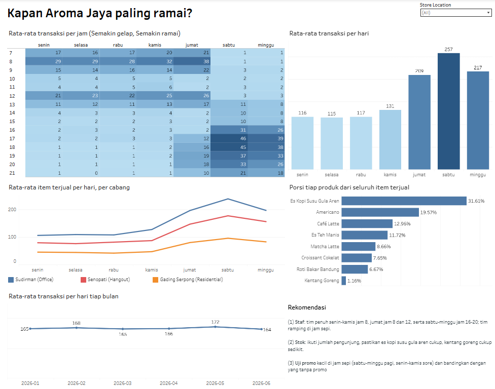
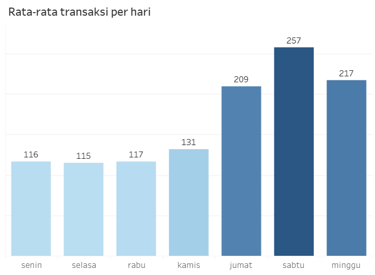
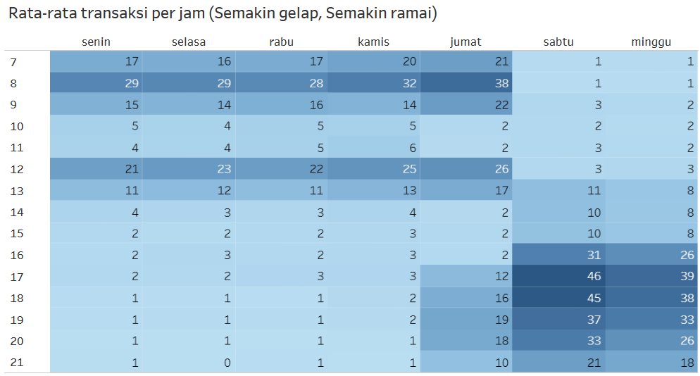
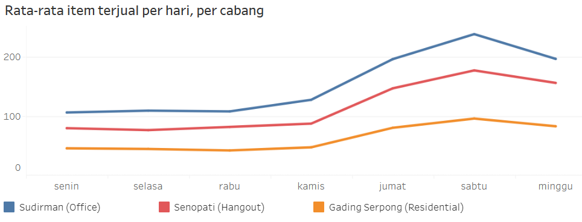
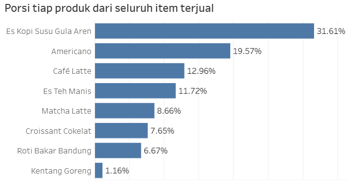
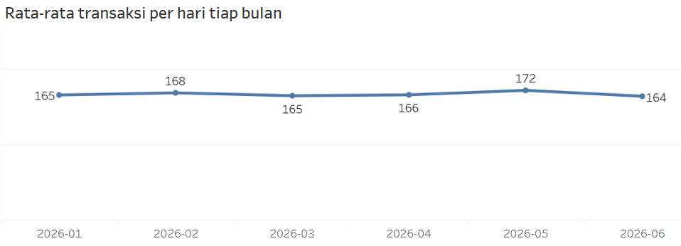

# Kapan Kedai Kopi Paling Ramai? Analisis Penjualan untuk Mengatur Staf dan Stok

> Analisis data kasir (POS) **Aroma Jaya**, kedai kopi dengan 3 cabang, untuk membantu owner menjawab satu pertanyaan sederhana: **kapan staf dan stok perlu ditambah, dan kapan boleh dikurangi?**

**Oleh:** Agi Agustian Davi | **LinkedIn:** [https://www.linkedin.com/in/agi-agustian-davi] | **Dashboard Tableau:** [Buka di Tableau Public](https://public.tableau.com/views/AromaJaya-Kapantokopalingramai/Dashboard1)

---

## Ringkasan untuk yang tidak punya waktu membaca semuanya

- **Hari paling ramai adalah Sabtu**, lalu Minggu dan Jumat. Sabtu sekitar **2 kali lebih ramai** daripada Senin sampai Rabu.
- **Jamnya berbeda tiap hari.** Senin–Kamis ramai di pagi (jam 7–9) dan makan siang (jam 12–13). Jumat ramai di pagi, siang, **dan malam**. Sabtu–Minggu sepi sampai siang, lalu **ramai jam 16–20**.
- **Ketiga cabang punya pola yang sama**, hanya ukurannya yang berbeda. Jadwal kerja yang sama bisa dipakai, tinggal disesuaikan jumlah orangnya.
- **Menu yang laku tidak berubah sepanjang hari.** Es Kopi Susu Gula Aren selalu menjadi yang terlaris (sekitar sepertiga dari semua penjualan).
- **Penjualan stabil** dari Januari sampai Juni, tidak naik dan tidak turun.


<!-- GANTI: screenshot dashboard Tableau secara utuh -->

[Buka dashboard di Tableau Public](https://public.tableau.com/views/AromaJaya-Kapantokopalingramai/Dashboard1)

---

## 1. Latar belakang dan pertanyaan

Owner Aroma Jaya memiliki 3 cabang (Sudirman, Senopati, Gading Serpong). Staf dan stok bahan selama ini disiapkan sama rata setiap hari. Padahal kedai tidak selalu sama ramainya, sehingga ada jam yang kewalahan dan ada jam yang hampir kosong.

**Keputusan yang dibantu analisis ini:** mengatur jumlah staf dan stok sesuai hari dan jam yang ramai.

Pertanyaan yang dijawab:

1. Hari apa yang paling ramai?
2. Jam berapa yang paling ramai di tiap hari?
3. Apakah polanya sama di ketiga cabang?
4. Apakah menu yang laku berbeda di jam atau hari tertentu?
5. Apakah penjualan naik, turun, atau stabil dari bulan ke bulan?

## 2. Data yang dipakai

| | |
|---|---|
| Sumber | [isi sumber dataset] (dipakai sebagai data latihan) |
| Isi | Catatan transaksi kasir: tanggal, jam, cabang, produk, jumlah, harga, dan jenis pesanan (makan di tempat atau bawa pulang) |
| Periode | 1 Januari sampai 29 Juni 2026 (180 hari) |
| Ukuran | 42.643 baris data, sekitar 30.000 transaksi, 3 cabang, 8 produk |

**Istilah yang dipakai di sini:** satu *transaksi* adalah satu struk pembelian. Satu transaksi bisa berisi beberapa produk, jadi jumlah baris data lebih banyak daripada jumlah transaksi.

## 3. Cara kerja

Proyek ini mengikuti enam tahap: **Tanya, Siapkan, Bersihkan, Analisis, Sajikan, Rekomendasikan**.

| Tahap | Dikerjakan dengan | Hasil |
|---|---|---|
| Tanya | - | Menentukan keputusan dan pertanyaan di atas |
| Siapkan (memeriksa data) | Python | `notebooks/data_profiling.ipynb` |
| Bersihkan | Python | `notebooks/data_cleaning.ipynb`, `data/cleaned_data.csv`, `docs/log_cleaning.md` |
| Analisis | Excel | `excel/analisis_aroma_jaya.xlsx` |
| Sajikan | Tableau | [Dashboard di Tableau Public](https://public.tableau.com/views/AromaJaya-Kapantokopalingramai/Dashboard1) |
| Rekomendasikan | - | Bagian 5 di bawah |

## 4. Apa yang saya temukan

> **Cara menghitung "rata-rata per hari":** jumlah transaksi dibagi jumlah harinya. Ini supaya hari atau bulan yang kebetulan punya lebih banyak hari tidak terlihat lebih ramai tanpa alasan. Misalnya, data ini punya 26 hari Sabtu tetapi hanya 25 hari Selasa.

### 4.1 Sabtu paling ramai, dan keramaian dimulai dari Jumat

| Hari | Rata-rata transaksi per hari (3 cabang) |
|---|---|
| Senin | 116 |
| Selasa | 115 |
| Rabu | 117 |
| Kamis | 131 |
| **Jumat** | **209** |
| **Sabtu** | **257** |
| **Minggu** | **217** |

Jumat sudah ramai hampir seperti akhir pekan, walaupun secara kalender Jumat termasuk hari kerja. Karena itu, hari tidak dikelompokkan sebagai "hari kerja" dan "akhir pekan", melainkan dilihat satu per satu.


<!-- GANTI: screenshot tabel/pivot "1. Hari apa yang paling ramai" dari Excel, atau grafik batang dari Tableau -->

### 4.2 Jam ramainya berbeda tiap hari: ada tiga pola

Peta di bawah menunjukkan rata-rata transaksi per jam. **Semakin hijau, semakin ramai.**


<!-- GANTI: screenshot peta warna (heatmap) jam x hari dari Excel atau Tableau -->

- **Senin sampai Kamis: dua gelombang.** Pagi (jam 7–9) dan makan siang (jam 12–13). Dua gelombang ini menampung sekitar **80% transaksi** hari itu. Jam 8 adalah yang paling padat. Setelah jam 14, kedai hampir kosong (rata-rata 1–3 transaksi per jam untuk ketiga cabang digabung).
- **Jumat: tiga gelombang.** Pagi dan siang (sekitar 59% transaksi) ditambah gelombang malam jam 17–21 (sekitar 36%). Jam 8 pagi hari Jumat adalah jam hari kerja yang paling padat.
- **Sabtu dan Minggu: satu gelombang besar di sore hari.** Sampai jam 12 hampir kosong (sekitar 5% transaksi). Mulai jam 16 mendadak ramai dan memuncak jam 17–18. Di hari Sabtu, jam 16–20 saja menampung sekitar **75% transaksi** hari itu.

### 4.3 Ketiga cabang punya pola yang sama

| Cabang | Porsi dari seluruh penjualan |
|---|---|
| Sudirman | 47% |
| Senopati | 35% |
| Gading Serpong | 19% |

Di ketiga cabang, Jumat sampai Minggu sama-sama sekitar 2 kali lebih ramai daripada Senin sampai Rabu. Jam ramainya juga sama. Yang berbeda hanya ukurannya: Sudirman sekitar **2,5 kali** Gading Serpong, dan Senopati sekitar **1,8 kali**.


<!-- GANTI: screenshot tabel "rata-rata per cabang x hari" dari Excel, atau grafik dari Tableau -->

> **Catatan jujur:** nama cabang di data (Sudirman *Office*, Senopati *Hangout*, Gading Serpong *Residential*) tidak terlihat di pola penjualannya. Misalnya cabang Office tidak lebih sepi di akhir pekan. Jadi analisis ini tidak menjelaskan pola dengan karakter lokasi cabang.

### 4.4 Menu yang laku sama sepanjang hari

Dari setiap 100 item yang terjual:

| Produk | Jumlah per 100 item |
|---|---|
| Es Kopi Susu Gula Aren | 32 |
| Americano | 20 |
| Café Latte | 13 |
| Es Teh Manis | 12 |
| Matcha Latte | 9 |
| Croissant Cokelat | 8 |
| Roti Bakar Bandung | 7 |
| Kentang Goreng | 1 |

Komposisi ini hampir sama di pagi dan sore, dan juga sama di Senin–Kamis dan Jumat–Minggu (selisih tiap produk kurang dari 1 poin persen antara pagi dan sore). Tidak ada produk yang "khusus pagi" atau "khusus akhir pekan". Yang berubah hanya **jumlah pembelinya**.


<!-- GANTI: screenshot tabel "4. Produk apa yang dominan di jam berbeda" dari Excel, atau grafik dari Tableau -->

### 4.5 Penjualan stabil dari bulan ke bulan

| Bulan | Rata-rata transaksi per hari |
|---|---|
| Januari | 165 |
| Februari | 168 |
| Maret | 165 |
| April | 166 |
| Mei | 172 |
| Juni | 164 |

Angkanya hanya bergerak sedikit dan tidak ada arah naik atau turun. Total per bulan terlihat naik-turun (Februari terendah, Mei tertinggi), tetapi itu karena jumlah hari tiap bulan berbeda. Mei juga punya 15 hari Jumat–Minggu (bulan lain 12–14), yaitu hari-hari yang memang ramai.


<!-- GANTI: screenshot tabel "5. Tren Bulanan" dari Excel, atau grafik garis dari Tableau -->

## 5. Rekomendasi untuk owner

### 5.1 Atur staf menurut tingkat keramaian

Satu jadwal yang sama dipakai di ketiga cabang. Jumlah orangnya disesuaikan dengan ukuran cabang (Sudirman paling banyak, lalu Senopati, lalu Gading Serpong).

Tingkat keramaian (jumlah transaksi per jam untuk ketiga cabang digabung):

- **Sangat ramai:** 25 transaksi atau lebih per jam
- **Ramai:** 10 sampai 25
- **Sepi:** kurang dari 10

| Tingkat | Hari dan jam |
|---|---|
| **Sangat ramai** (tim penuh) | Senin–Kamis jam 8 · Jumat jam 8 dan 12 · Sabtu dan Minggu jam 16–20 |
| **Ramai** (tim normal) | Senin–Kamis jam 7, 9, 12, 13 · Jumat jam 7, 9, 13 dan 17–21 · Sabtu jam 13–15 dan 21 · Minggu jam 21 |
| **Sepi** (tim ramping) | Jam lainnya, termasuk Senin–Kamis setelah jam 14 dan Sabtu–Minggu pagi |

Cara menjalankannya: sistem **shift**. Misalnya shift pagi dan siang untuk hari kerja, serta shift sore dan malam untuk Jumat sampai Minggu.


<!-- GANTI: screenshot bagian jadwal/tingkat keramaian di dashboard Tableau, atau tabel di atas yang sudah diberi warna -->

### 5.2 Atur stok menurut jumlah pengunjung, bukan menurut jenis produk

- Karena menu yang laku sama di semua jam, **jumlah stok semua produk naik dan turun bersama jumlah pengunjung**. Contohnya, hari Sabtu butuh stok sekitar 2 kali lipat hari Senin sampai Rabu.
- **Pastikan Es Kopi Susu Gula Aren selalu cukup.** Ini produk terlaris sepanjang hari, sekitar sepertiga dari seluruh penjualan.
- **Kentang Goreng cukup disiapkan sedikit** (hanya sekitar 1% penjualan). Datanya tidak memuat biaya atau sisa stok, jadi sebaiknya dipantau dulu setelah dikurangi.

### 5.3 Coba promo kecil di jam yang sepi

Ada jam yang kedainya hampir kosong: **Sabtu dan Minggu pagi**, serta **Senin sampai Kamis sore dan malam**. Usulannya, **uji promo kecil di jam tersebut**, lalu bandingkan dengan cabang atau hari yang tidak mendapat promo. Kalau jam sepi ternyata ikut ramai, promo bisa diteruskan. Kalau tidak, promo dihentikan. Ini ide untuk diuji, **bukan hasil yang sudah terbukti** dari data.

## 6. Hal yang tidak bisa dijawab oleh data ini

- **Jumlah staf dan kemampuan melayani per orang.** Tingkat keramaian di atas menunjukkan arah, bukan jumlah orang yang tepat. Owner perlu memasukkan data kemampuan melayani per orang.
- **Biaya, stok, dan sisa bahan.** Data hanya memuat penjualan, jadi penghematan tidak bisa dihitung.
- **Pelanggan baru atau lama.** Data tidak memuat identitas pelanggan, jadi strategi mencari pelanggan baru dan mempertahankan pelanggan lama tidak bisa dibandingkan.
- **Sebagian transaksi tercatat di dua cabang atau lebih.** Sebanyak 831 dari sekitar 30.000 transaksi (2,8%) punya produk yang tercatat di cabang berbeda, padahal satu struk seharusnya satu cabang. Baris ini dibiarkan apa adanya. Akibatnya, perbandingan antarcabang memakai **jumlah item**, bukan jumlah transaksi.
- **Bulan Juni tidak lengkap.** Data berakhir 29 Juni.
- **Batas tingkat keramaian** (25 dan 10 transaksi per jam) adalah pilihan saya agar mudah dibaca, bukan angka yang dihitung dari data.

## 7. Pembersihan data singkat

Sebelum dianalisis, data diperiksa dan dibersihkan. Dari 42.643 baris, **hanya 60 baris (0,14%) yang dibuang**:

- 35 baris dobel (persis sama)
- 10 baris dengan jumlah −2 (tidak jelas apakah retur atau salah input)
- 15 baris dengan jumlah 99 (jelas salah input)

Sisanya diperbaiki, bukan dibuang: nama cabang yang tertulis dengan 6 cara berbeda diseragamkan menjadi 3, jenis pesanan dari 4 cara menjadi 2, dan 13 baris yang kosong diberi label "Unknown". Catatan lengkap ada di `docs/log_cleaning.md`.

## 8. Isi repositori

```
├── README.md
├── data/
│   ├── dataset_pos_aromajaya.csv    # data mentah
│   └── cleaned_data.csv             # data bersih
├── notebooks/
│   ├── data_profiling.ipynb         # memeriksa kondisi data
│   └── data_cleaning.ipynb          # membersihkan data
├── excel/
│   └── analisis_aroma_jaya.xlsx     # analisis (pivot)
├── docs/
│   └── log_cleaning.md              # catatan pembersihan
└── images/
    ├── dashboard_tableau.png
    ├── 01_hari_paling_ramai.png
    ├── 02_peta_panas_jam_hari.png
    ├── 03_perbandingan_cabang.png
    ├── 04_komposisi_produk.png
    ├── 05_tren_bulanan.png
    └── 06_usulan_jadwal_staf.png
```

## 9. Cara mengulang analisis

1. Unduh repositori ini.
2. Buka folder `notebooks/` dengan Jupyter, lalu jalankan `data_profiling.ipynb` dan `data_cleaning.ipynb` (semua sel, dari atas ke bawah). Notebook membaca `data/dataset_pos_aromajaya.csv` dan menghasilkan `data/cleaned_data.csv` serta `docs/log_cleaning.md`.
3. Buka `excel/analisis_aroma_jaya.xlsx` untuk melihat tabel pivot analisisnya.
4. Buka link Tableau Public di bagian atas untuk melihat dashboard.

Kebutuhan: Python 3 dengan pandas dan Jupyter.

## 10. Alat yang dipakai

- **Python (pandas, Jupyter):** memeriksa dan membersihkan data
- **Excel (PivotTable):** analisis
- **Tableau Public:** dashboard
